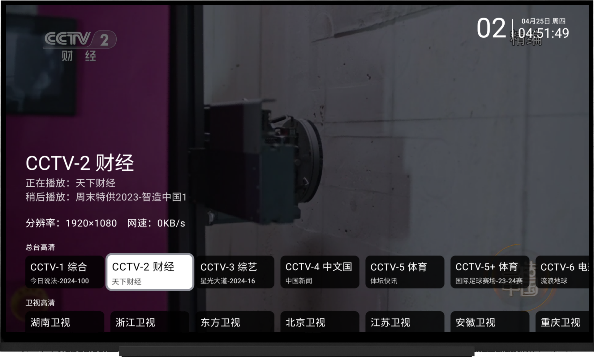
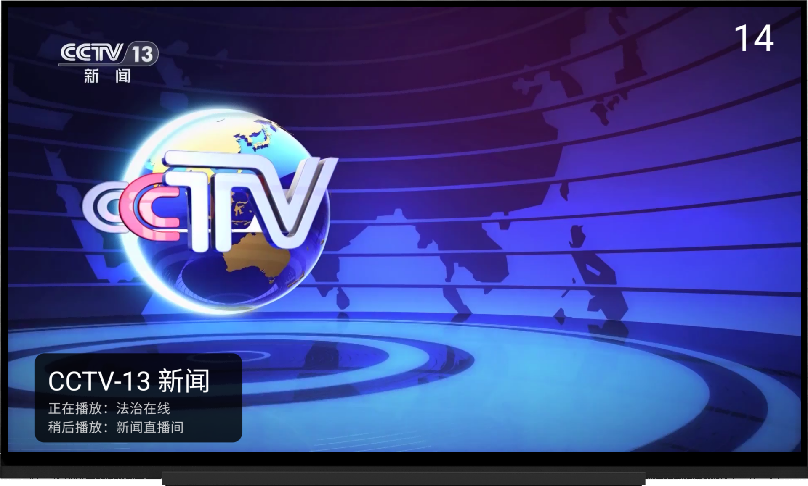
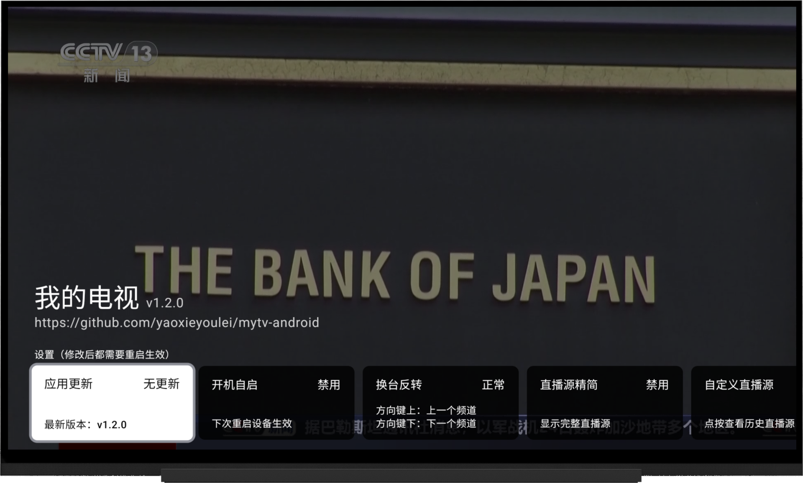

    <h1>我的电视</h1>

    
使用Android原生开发的电视直播软件

 

## 使用

### 操作方式

> 遥控器操作方式与主流电视直播软件类似；

- 频道切换：使用上下方向键，或者数字键切换频道；屏幕上下滑动；
- 频道选择：OK键；单击屏幕；
- 设置页面：按下菜单、帮助键，长按OK键；双击、长按屏幕；

### 触摸键位对应

- 方向键：屏幕上下左右滑动
- OK键：点击屏幕
- 长按OK键：长按屏幕
- 菜单、帮助键：双击屏幕

### 自定义设置

- 访问以下网址：`http://<设备IP>:10481`
- 打开应用设置界面，移到最后一项
- 支持自定义直播源、自定义节目单、缓存时间等等
- 须知：网页中引用了`jsdelivr`的cdn，请确保能够正常访问

### 自定义直播源

- 设置入口：自定义设置网址
- 格式支持：m3u格式、tvbox格式

### 多直播源

- 设置入口：打开应用设置界面，选中`自定义直播源`项，点击后将弹出历史直播源列表
- 历史直播源列表：短按可切换当前直播源（需重启），长按将清除历史记录；该功能类似于`多仓`，主要用于简化直播源切换流程
- 须知：
    1. 当直播源数据获取成功时，会将该直播源保存到历史直播源列表中
    2. 当直播源数据获取失败时，会将该直播源移出历史直播源列表

### 多线路

- 功能描述：同一频道拥有多个播放地址，相关标识位于频道名称后面
- 切换线路：左右方向键；屏幕左右滑动
- 自动切换：当当前线路播放失败后，将自动播放下一个线路，直至最后
- 须知：
    1. 当某一线路播放成功后，会将该线路的`域名`保存到`可播放域名列表`中
    2. 当某一线路播放失败后，会将该线路的`域名`移出`可播放域名列表`
    3. 当播放某一频道时，将优先选择匹配`可播放域名列表`的线路

### 自定义节目单

- 设置入口：自定义设置网址
- 格式支持：.xml、.xml.gz格式

### 多节目单

- 设置入口：打开应用设置界面，选中`自定义节目单`项，点击后将弹出历史节目单列表
- 具体功能请参照`多直播源`

### 当天节目单

- 功能入口：打开应用选台界面，选中某一频道，按下菜单、帮助键、双击屏幕，将打开当天节目单
- 须知：由于该应用不支持回放功能，所以更早的节目单没必要展示

### 频道收藏

- 功能入口：打开应用选台界面，选中某一频道，长按OK键、长按屏幕，将收藏/取消收藏该频道
- 切换显示收藏列表：首先移动到频道列表顶部，然后再次按下方向键上，将切换显示收藏列表；手机长按频道信息切换

## 下载

可以通过右侧release进行下载或拉取代码到本地进行编译

## 说明

- 主要解决 [my_tv](https://github.com/yaoxieyoulei/my_tv)（flutter）在低端设备上播放（4k）视频卡顿掉帧
- 仅支持Android5及以上
- 网络环境必须支持IPV6（默认直播源）
- 只在自家电视上测过，其他电视稳定性未知

## 功能

- [x] 换台反转
- [x] 数字选台
- [x] 节目单
- [x] 开机自启
- [x] 自动更新
- [x] 多直播源
- [x] 多线路
- [x] 自定义直播源
- [x] 多节目单
- [x] 自定义节目单
- [x] 频道收藏
- [x] 应用自定义设置
- [x] TV端适配
- [ ] 手机端适配
- [ ] 平板端适配
- [ ] 性能优化

## 更新日志

[更新日志](./CHANGELOG.md)

## 声明

此项目（我的电视）是个人为了兴趣而开发, 仅用于学习和测试。 所用API皆从官方网站收集, 不提供任何破解内容。

## 赞赏

## 致谢

- [my-tv](https://github.com/lizongying/my-tv)
- [参考设计稿](https://github.com/lizongying/my-tv/issues/594)
- [IPV6直播源](https://github.com/zhumeng11/IPTV)
- [live](https://github.com/fanmingming/live)
- 等等
