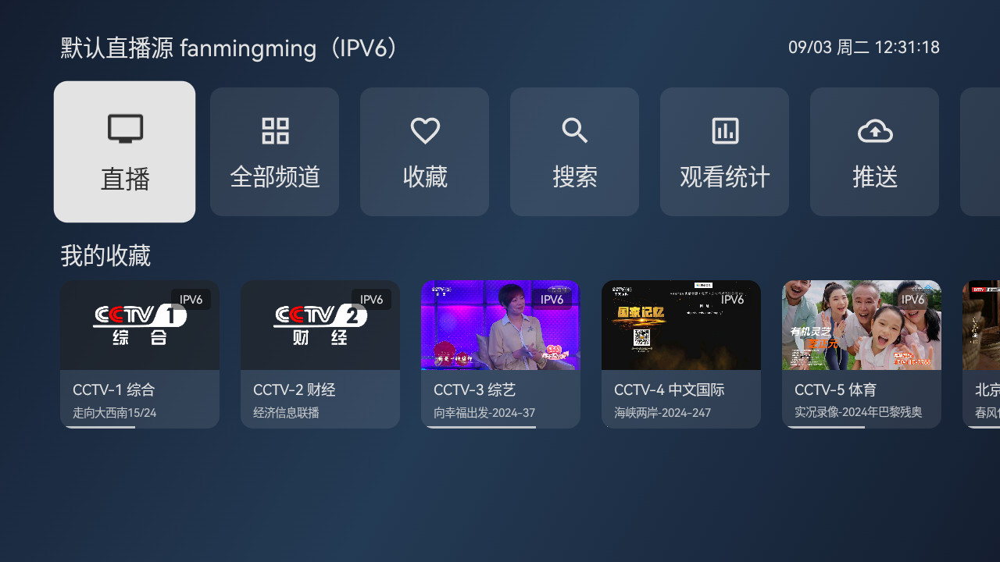
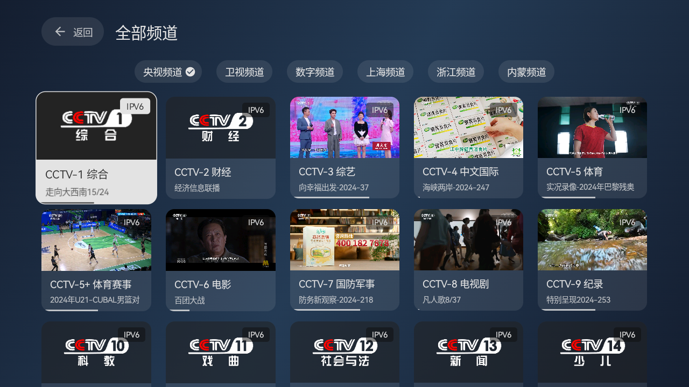
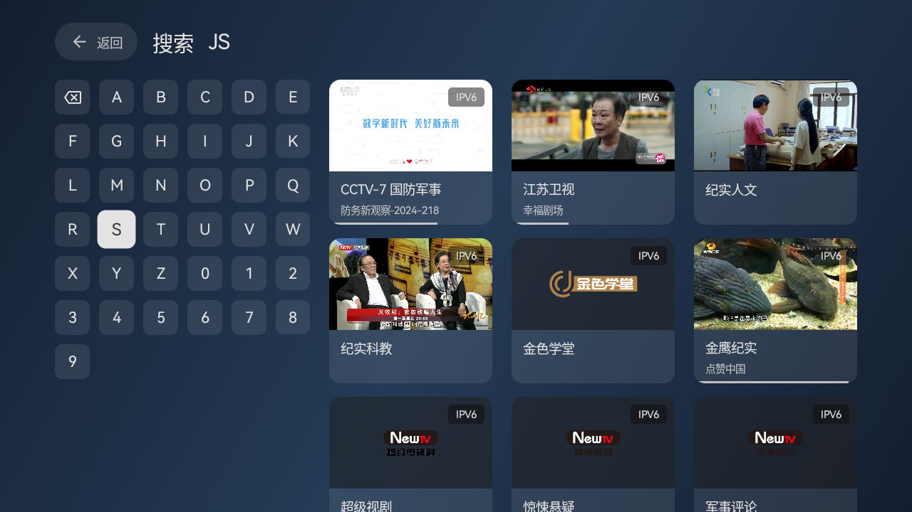

    <h1>天光云影TV</h1>

    
使用Android原生开发的电视直播软件

 

## 使用

### 操作方式

> 遥控器操作方式与主流电视直播软件类似；

- 频道切换：使用上下方向键，或者数字键切换频道；屏幕上下滑动；
- 频道选择：OK键；单击屏幕；
- 线路切换：使用左右方向键；屏幕左右滑动；
- 设置页面：按下菜单、帮助键，长按OK键；双击、长按屏幕；

### 触摸键位对应

- 方向键：屏幕上下左右滑动
- OK键：点击屏幕
- 长按OK键：长按屏幕
- 菜单、帮助键：双击屏幕

### 自定义设置

- 访问以下网址：`http://<设备IP>:10481`

## 下载

可以通过右侧release进行下载或拉取代码到本地进行编译

## 说明

- 仅支持Android5及以上
- 网络环境必须支持IPV6（默认直播源）
- 只在自家电视上测过，其他电视稳定性未知

## 更新日志

[更新日志](./CHANGELOG.md)